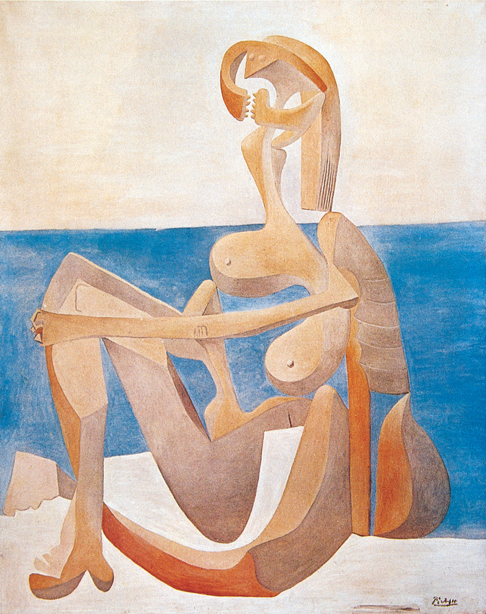

# Art-Gallery

## 基于互联网的图像演播系统的设计

#### 题目内容
设计一个数据库系统，存储图像（比如数码照片）的相关信息。再设计一个播放系统，播放数据库中的图像以及说明文字和解说音频。

#### 题目要求
数据库系统具有添加、保存、修改、删除等功能 ，以处理图像的相关信息，包括图像文件、图像文件名，以及说明文字、解说音频等。
播放系统可以按用户的要求，按指定的顺序或方式播放用户选择的图像以及说明文字和解说

#### 技术选型
+ 后台采用 node.js + MongoDB
+ 前端采用 vue + three.js

-----

西方20世纪美术史，艺术画廊(以下示例)

