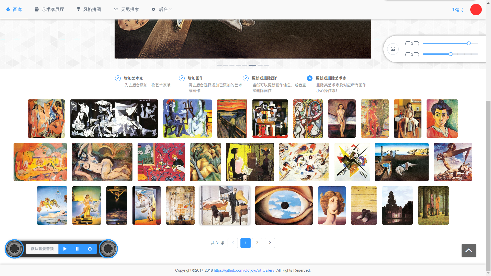

# Artoex

> 使用技术栈为：前端vuejs + iview，后台Nodejs + Express + MongoDB。
> 设计一个简单的数据库系统，存储图像（比如数码照片）的相关信息。再设计一个简单的播放系统，播放数据库中的图像以及说明文字和解说音频。
> 咳咳咳···当初好歹也花了我一个月的做的哈！

#### 功能点

+ 数据库系统具有添加、保存、修改、删除等功能 ，
+ 处理图像的相关信息，包括图像文件、图像文件名，以及说明文字、解说音频等。
+ 播放系统可以按用户的要求，按指定的顺序或方式播放用户选择的图像以及说明文字和解说

---

